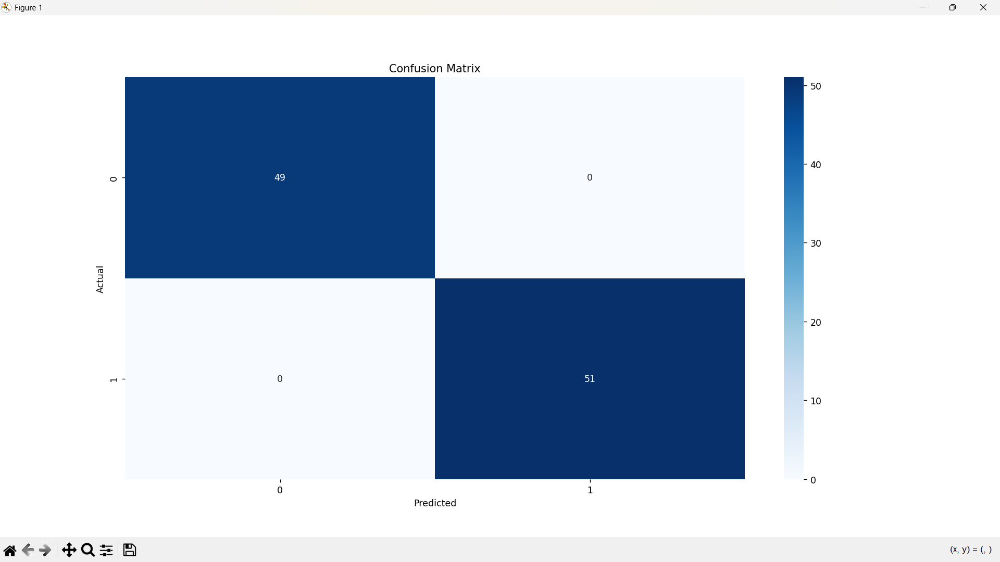

# Fake News Detection

## Overview
This project uses Machine Learning to classify news articles as **Fake** or **Real**.

## Features
- Load dataset
- Data preprocessing
- TF-IDF Vectorization
- Logistic Regression Model
- Accuracy Score
- Classification Report
- Confusion Matrix
- Predict custom news

## Technologies Used
- Python
- Pandas
- Scikit-learn
- Matplotlib
- Seaborn

## Dataset
The project uses a CSV file (`news.csv`) containing:
- title
- text
- label (0 = Fake, 1 = Real)

## How to Run

```bash
pip install pandas numpy scikit-learn matplotlib seaborn
python fake_news_detection.py

## Confusion Matrix

